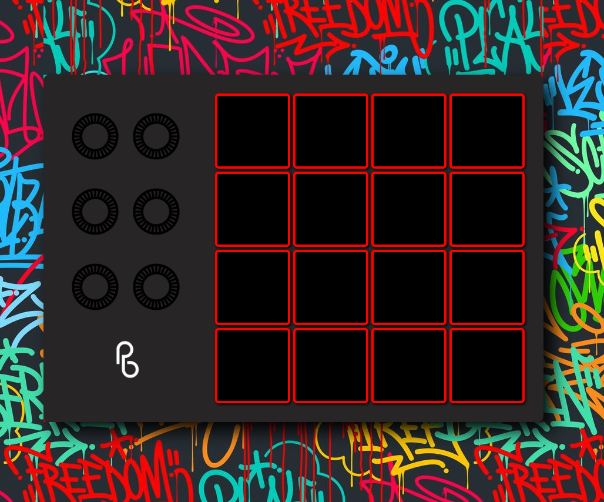
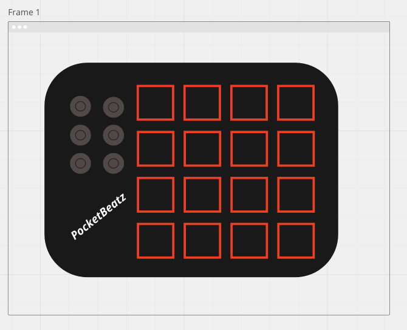

# __PocketBeatz__
 
 
 ### What's happenin
 ---
 PocketBeatz is a simple app which allows you to create unique beats on a drum machine so that you can freestyle with your friends without having to resort to beatboxing no matter where you are.

 ### Reflection
 ---
 Had a great time working on this project due to the lack of stress I was feeling for some reason. Started by cranking out the code for the functionality of the buttons using Next.js and Typescript which initially gave me some issues being a new language and all, but am now starting to get it a bit more.

 Next I worked on styling for a bit before realizing that I had not finished my functionality completely, as I had not written keydown functions to link certain keys to the correct buttons. This was quite infuriating and took much longer than it should have, but with a little help from Weston I figured out that I wasn't too far off and finally got it working.

 Lastly I finished with my styling using styled components which I thought was a pretty cool technology and very simple to implement. I got the computer screen version working well but had to get creative with the mobile styling where I used to janky styling to get everything in the right place. Will need to go back and write the media querys out a bit better.
 
 ### Installation Instructions to Local
 ---
  1. clone the repo
  2. npm i OR npm install in relevant directory
  3. npm run dev
  4. open localhost:300 in browser

 ### Tech Used
 ---
 - Next.js
 - Typescript
 - CSS (styled-components)

 

 ### UserFlow
 ---
 Once user navigates to page they will immediately be able to start making their very own beats with the click of their mouse or tap of their finger. In addition to the 16 beat pad buttons, there will be seperate buttons which enable to change beat library that produces different percussive sounds (stretch).

 ### MVP
 ---
 * Create a grid screen with twelve clickable boxes
 * Boxes make certain percussive noise when clicked on (or tapped on mobile device)
 * Render instructions button
 * Buttons to switch sound libraries
 * Use Tailwind to create a very nice looking beatpad
 * Use mediaquery to make app extremely accesible via phone

 ### Stretch Goals
 ---
 * Link certain keys on keyboard so that user doesn't have to click to make beats
 * Include background animations for when certain buttons are pressed 
 * Ability to record beat and play it back
 * Development of fullstack MERN app so user can save beat they created
  - Create login and sign up pages, as well as saved beats pages
 * Ability to edit saved beats
 * Sequencer (ABLETON LIVE)
 
 